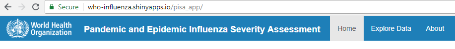
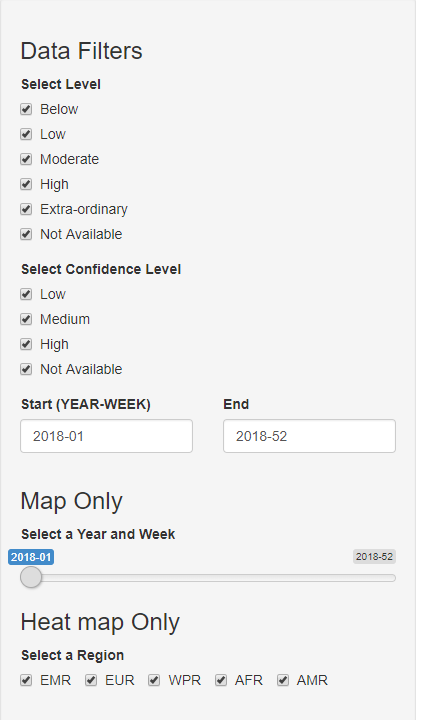
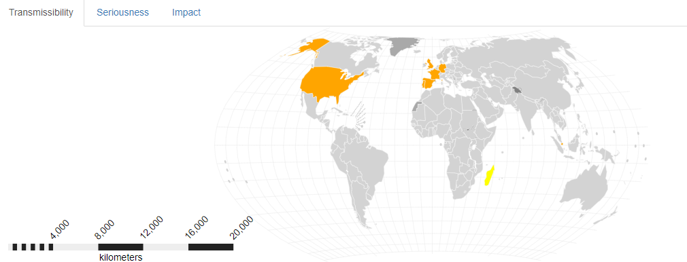
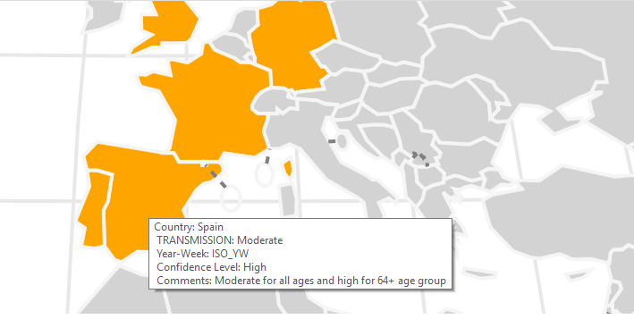
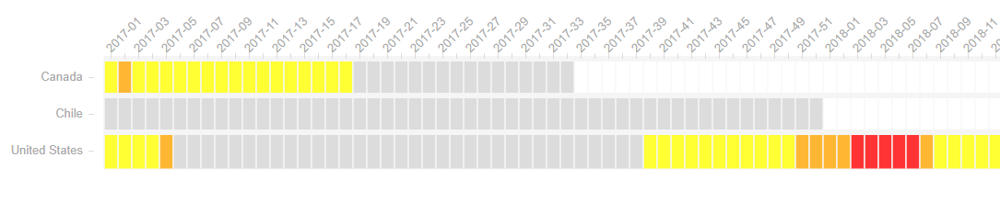
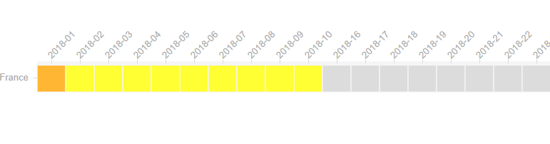

```{r setup, include=FALSE}
knitr::opts_chunk$set(echo = TRUE)
```

## Introduction

The **Pandemic and Epidemic Influenza Severity Assessment (PISA)** application provides users with a geographic and time series view of flu data provided by participating countries. This user guide is intended to provide a summary of features. The guide is divided into the following parts:

- review of the single-page app tabs

- summary of user inputs

- global map

- heatmap

## The Single-page App

The PISA app uses the R Shiny framework of a single-page application. Rather than having separate tabs on separate pages, the app contains all sections including the static material. This differs from many sites that have different web addresses/pages for different sections. With the PISA app, the user never leaves the page.  The App is divided into three areas



- Home

- Explore Data

- About

### Home Tab

The Home Tab is the landing page for the app and welcomes the user. Any notices or information about the app will be posted to this page.

### Explore Data Tab

The Explore Data Tab provides the user with bulk of the application and supports a diverse interactive experience for the user. The data populating the user inputs and charts come from the FLUMart data warehouse, uploaded by participating countries.  Data represents categorical levels of transmissibility, severity, and impact over time. To that end, the data visualizations exist across three sub-tabs for each measure.  The user inputs centrally control all data across those sub-tabs and data visualizations.

### About Tab

The About Tab is currently just a placeholder.

## User Inputs

The User Inputs define data filters for the data visualizations.  The top 3 inputs define time periods, the rest define measure categories and geographic regions.



The time periods can toggle between northern hemisphere flu season calendars, southern hemispher fle season calendars, or both seasons.  From there, the use may select which season they want to review. All historic seasons available in the data can be selected. The third input is a week slider for the global map. This slider updates as the user selects different flue seasons

The categories for `Levels` include measure levels for tranmissibility, severity, and impact

The `Confidence Levels` filter includes the confidence level in the measure.

The `Region` filter includes geographic WHO regions.

Changes to any User input will trigger a chart update

## Global Map

The global map displays by color the measure's categorical level for each week.  



Users may zoom in by clicking on any country and zoom out by clicking the country a second time.  A tool tip will appear when the user hovers the mouse over a country.



The map uses a Wagner Projection that attempts to represent equatorial geographies in more correct proportion to non-equatorial geographies.  The lat-long lines should help orientate the user to the relative size. Given the complexity of the projection, the scale legend represent an estimated distance.

The legend in the upper right hand corner provides the color coding for each measure's category.

## Heat Map

The heat map displays by the color the measure's cateogrical level for all weeks in the season. A tooltip will appear when the user hovers over a tile and the x-axis will highlight the week of interest.



#### Interaction with Global Map

In addition to the click-zoom of the global map, the click-zoom feature can also filter the heat map to that country of interest. If there is no data for that country, no filter is applied to the heat map.



## Getting Help

Contact WHOinfluenza@who.int with any questions or comments.
