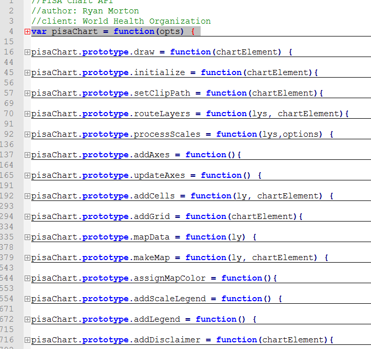

```{r setup, include=FALSE}
knitr::opts_chunk$set(echo = TRUE)
library(dplyr)
library(tidyr)
library(pisaR)
df <- readRDS("./www/data.Rds")
df_heat <- df %>% 
  filter(ISO_YEAR =="2017")
df_map <- df_heat %>%
  filter(ISOYW == "201701")
```

## Introduction

This guided intends to describe the PISA app and its underlying software. When appropriate, this guide instructs technical staff in the maintenance and additions to the application and underlying software.

This guide starts with an overview of the design philosophy and workflow. It then proceeds to the underlying software supporting the app and finishes with the app itself.

**If you're reading this guide to debug or make changes, please consider whether the issue relates to the plots in the browser (probably `pisaAPI.js`), the UI in the browser(probably `shiny` or `shinyWidget`), or the server (definitely R/Shiny).**

## Design Philosophy

The design incorporates two basic ideas: data-driven UI and "everything updates."

Data-driven UI means that the data is used to render the UI as much as possible.  While this generally ensures UI options are available for any data available, it also means that errors in the data can cause errors downstream.  In the case of the measure levels and confidence levels, the categories were coded into the UI due to unpredictable errors and different spellings in the data.  Otherwise, you can count on updates in the data to drive updates in the app without changing the app.

"Everything updates" means that all content updates in response to the data. This is expressed most completely with the `pisaAPI.js` where different data elements cause updates to the plots rather than erasing the plot and drawing again.  In particular, since the plots utilize SVG graphics, the API really just manipulates the DOM rather than replace the image. So a `path` tag gets updated by moving, changing color, changing opacity, or whatever else.

## Workflow

### Get the Data - `load_data.R`

To create the application, the server first calls the web service using:

```{r api_data, eval=FALSE, echo=TRUE}
##paste the year (current or previous) intot the query
call <- paste0("http://apps.who.int/gho/athena/flumart/MEASURE/IMPACT,IMPACT_CL,IMPACT_COM,TRANSMISSION,TRANSMISSION_CL,TRANSMISSION_COM,SERIOUSNESS,SERIOUSNESS_CL,SERIOUSNESS_COM?filter=YEAR:",
               year_current,
               "&format=json&profile=pisa")

## pass the query and authentication to the GET request
get_data <- GET(call, authenticate(username, password, type = "basic"))
```

This call returns a JSON object that can be translated into an R data frame and used to populate the application.The `load_data.R` script also cleans known data issues prior to creating any app element.

PLEASE NOTE: the username and password can only be reset in the R environment by changing the `token.RDS` file.

While originally designed to be completely data driven, the UI relies on a mix of coded UI choices and  data driven UI choices:

```{r UI_choices, eval=FALSE, echo=TRUE}
## create UI data
year_ui <- sort(unique(df$ISO_YEAR[nchar(df$ISO_YEAR) == 4])) #Incorrect Year in data

levels_ui <- c("Below seasonal threshold", "Low", "Moderate", "High", "Extra-ordinary", "Not Available", "No Impact") #inconsistent spellings in data

confidence_ui <- c("Low", "Medium", "High", "Not Available") # insconsistent spellings in data

who_region_ui <- c("Region of the Americas"="AMR",
                   "European Region" = "EUR",
                   "Western Pacific Region" = "WPR",
                   "African Region"= "AFR",
                   "Eastern Mediterranean Region" = "EMR",
                   "South-East Asia Region" = "SEAR")
who_region_ui <- sort(who_region_ui)
```

We can now start building the application.

### Shiny Server

The Shiny server starts a session every time a user logs on to the application. From there, the server can render UI elements, render text, and render charts.

##### Rendered UI Elements

To render the UI, the Shiny UI functions are passed to the `render()` function that assigns the name of the relevant `div` to be placed on the web page:

```{r render_ui, eval=FALSE, echo=TRUE}
## render UI elements using data available
  output$level_filter <- renderUI({
    checkboxGroupInput("level_filter",
                "Select Level of Activity",
                choices = levels_ui,
                selected = levels_ui,
                inline = FALSE)
  })
```

This server side rendering ensures that the UI is up to date with whatever is available in the data. Please note that UI choices that are currently coded could easily be updated to become data driven given that all user inputs are rendered by the server.

##### Filtered Data Pipeline

To ensure all exhibits use the same data, a single filter sequence enforces user input filtering:

```{r filter, eval=F, echo=T}
## reactive data frame updates whenever the inputs change so the filter is always enforced
filter_data <- reactive({
    req(input$season_start)
    ##season filter breakdown
    start <- gsub("-", "",input$season_start)
    end <- gsub("-", "",input$season_end)

    # season and region filtered table
    # level and confidence level depends on which tab (id = explore) is active
    if(input$explore == "Transmissibility"){
      df_this <- df %>%
        filter(ISOYW >= start) %>%
        filter(ISOYW <= end) %>%
        filter(WHOREGION %in% input$region_filter) %>%
        filter(TRANSMISSION %in% input$level_filter) %>%
        filter(TRANSMISSION_CL %in% input$cl_filter) %>%
        filter(!is.null(ISOYW))
    } else if(input$explore == "Seriousness"){
      df_this <- df %>%
        filter(ISOYW >= start) %>%
        filter(ISOYW <= end) %>%
        filter(WHOREGION %in% input$region_filter) %>%
        filter(SERIOUSNESS %in% input$level_filter) %>%
        filter(SERIOUSNESS_CL %in% input$cl_filter)%>%
        filter(!is.null(ISOYW))
    } else if(input$explore == "Impact") {
      df_this <- df %>%
        filter(ISOYW >= start) %>%
        filter(ISOYW <= end) %>%
        filter(WHOREGION %in% input$region_filter) %>%
        filter(IMPACT %in% input$level_filter) %>%
        filter(IMPACT_CL %in% input$cl_filter)%>%
        filter(!is.null(ISOYW))
    }

  })

```

This reactive data frame can then be called by any other server function via `filter_data()` as reactive data frames get called like functions rather than regular named data frames.

#### Render Charts and Maps

To render all charts and maps, the app uses a custom `htmlwidget` developed using d3.js: `pisaR`. `pisaR` exists as its own R library with its own functions covered in a later section in more detail. Each chart for each tab gets it's own output id. To properly render the chart, we user a special render function to wrap our chart in the html necessary - `renderPisaR()`. This function can convert `pisaR` output to the appropriate html for the application.

Secondary filters are placed within the `layerData` argument of the `createLayer()` function to filter to a week for the global map or to a country for the heatmap.

```{r render_pisaR, eval=F, echo=T}
output$map_transmission <- renderPisaR({
    req(input$week_filter)
    # call the widget
      pisaR()%>%
    # create the appropriate layer
      createLayer(layerType = "globalMap",
                  layerColor = list("green","yellow", "orange", "red", "darkred"),
                  layerLabel = "map",
                  layerData = filter_data() %>%
                    filter(ISO_YW == input$week_filter) %>%
                    select(TRANSMISSION, TRANSMISSION_CL, TRANSMISSION_COM,ISO2, ISO_YW),
                  layerMapping = list(color_var = "TRANSMISSION",
                                      time_var = "ISO_YW",
                                      key_data = "ISO2",
                                      key_map = "ISO_2_CODE",
                                      cl_var = "TRANSMISSION_CL",
                                      com_var = "TRANSMISSION_COM")) %>%
    # define the color scale
      defineColorScale(color_palette = list("green","yellow", "orange", "red", "purple", "lightgray", "gray"),
                       color_key = list("Below seasonal threshold", "Low", "Moderate", "High", "Extra-ordinary", "Not Available", "Not Applicable")) %>%
    # define the plot margins
      definePlotMargin(top = 0, left = 10, bottom = 100, right = 150) %>%
    # assign colors to map objects by ISO2 abbreviation
      assignMapColor(country = list("GL", "EH"), color = "darkgrey")

  })
```

### Shiny UI

After the server renders the application elements, the Shiny UI object defines the placement of every object by id. For example, `uiOutput(outputId = "level_filter")` yields the output from the id `level_filter` and `pisaROutput("map_transmission", width = "100%", height = "450px")` yields the output from `map_transmission`. These various outputs are placed within a simplle navigation bar and tabset layout.

#### The Navigation Bar

The navigation bar sits at the top of the app and allows the user to navigate between the Home, About, and Explore Data areas.To assign links, headers, colors, and logos, the following items are added as arguments to the `navbar()` function:

```{r nav_bar, eval=FALSE, echo=TRUE}
windowTitle = "WHO | PISA",
  # Application title with links to WHO and PISA
  title = HTML('<span class="navtitle">
               <a rel="home" href="http://who.int" title="World Health Organization">
               </a>
               <a rel="home" href="http://www.who.int/influenza/surveillance_monitoring/pisa/en/" title="PISA Home Page">
               <span class="navtext">Pandemic and Epidemic Influenza Severity Assessment</a></span></span>'),

```

After which each tab gets placed and named. Keep in mind that Home and About load static HTML content.

```{r nav_tabs, eval =F, echo=T}
tabPanel(title = "Home",
           #load static HTML content for Home and About
           HTML(readLines("./www/home_page.html"))),
  tabPanel(title = "About",
           HTML(readLines("./www/about_page.html"))),
  tabPanel(title = "Explore Data"...)
```

#### The Explore Data Tabset

The main functionality of the app occurs in the Explore Data tab and sub-tabs. This section's layout is a `fluidRow` and two columns: User Inputs and graphical output.

The tabset panel is given an `id` so that it can be used as a input for filtering data based on the active tab.

### CSS

`www/style.css` holds the Cascading Style Sheets (CSS) for the app and primarily styles the navigation bar.

## JavaScript Library: `pisaAPI.js`

To generate graphics in the browser, the application creates instances of `pisaChart` via the `pisaAPI.js`. This is done using an intermediary R library, `htmlwidgets`.

#### API Architecture

The API is a higher level version of the `d3.js` v4 API using a ES5 standard object oriented programming framework (ES6 throws an error in RStudio still). The basic workflow is to intialize the instance, place common SVG elements on the webpage, route plot layers to the correct scale and drawing functions, and update with new data.

The API takes a single JSON argument as input containing the `element`, `plotLayers`, and `options` necessary for creating the chart object.

```{javascript, chart_init, eval = F, echo = T}
var pisaChart = function(opts) {
	
	//pass chart elements
	this.element = opts.element;
	this.plotLayers = opts.plotLayers;
	this.options = opts.options;
	
	//create the chart 
	//widget calls the update function if chart already exists
	this.draw(this.element);
}
```

Each function represents a particular task and the developer has made every effort to make these tasks human readable:



## `pisaR` R Library

The `pisaR` library extends the API with R programming. All functions in the library are intended to properly prepare the JSON message to the API.

The library utilizes a YAML file that attaches the API and the API's CSS companion file to the head of the HTML document upon loading.

### Global Map Example

The global Map is demonstrated with this example:

```{r global_map_1, eval=FALSE}
pisaR(width = "100%", height = "400px", elementId = "globalMap")%>%
      createLayer(layerType = "globalMap",
                  layerColor = list("green","yellow", "orange", "red", "darkred"),
                  layerLabel = "map",
                  layerData = df_map %>%
                    #filter(ISO_YW == input$week_filter) %>%
                    select(TRANSMISSION, TRANSMISSION_CL, TRANSMISSION_COM,ISO2, ISO_YW),
                  layerMapping = list(color_var = "TRANSMISSION",
                                      time_var = "ISO_YW",
                                      key_data = "ISO2",
                                      key_map = "ISO_2_CODE",
                                      cl_var = "TRANSMISSION_CL",
                                      com_var = "TRANSMISSION_COM")) %>%
      defineColorScale(color_palette = list("green","yellow", "orange", "red", "purple", "lightgray", "gray"),
                       color_key = list("Below", "Low", "Moderate", "High", "Extra-ordinary", "Not available", "Not applicable")) %>%
      definePlotMargin(top = 0, left = 0, bottom = 100, right = 100)
```

### Heat Map Example

The heat map is deomonstrated with this example:

```{r heat_map_1, eval=FALSE}
  pisaR(width = "100%", height = "400px", elementId = "heatmap") %>%
      createLayer(layerType = "heatmap",
                  layerColor = list("green","yellow", "orange", "red", "darkred"),
                  layerLabel = "heat",
                  layerData = df_heat %>%
                    select(TRANSMISSION, TRANSMISSION_CL, TRANSMISSION_COM,COUNTRY_TITLE, ISO_YW, ISOYW) %>%
                    arrange(desc(COUNTRY_TITLE), ISOYW),
                  layerMapping = list(x_var = 'ISO_YW',
                                      y_var = 'COUNTRY_TITLE',
                                      z_var = "TRANSMISSION",
                                      cl_var = "TRANSMISSION_CL",
                                      com_var = "TRANSMISSION_COM")) %>%
      defineColorScale(color_palette = list("green","yellow", "orange", "red", "purple", "lightgray", "gray"),
                       color_key = list("Below", "Low", "Moderate", "High", "Extra-ordinary", "Not Available", "Not Applicable")) %>%
      definePlotMargin(left = 110)
  
```


### R Functions

#### `createLayer()`

The main workhorse of the R pacakge is the`createLayer()` function. It takes several arguments to properly create a plot layer:

- `layerType` takes a string argument to define the chart as either a "globalMap" or "heatmap"

- `layerColor` takes a list of colors, but can be overruled by the `defineColorScale()` function if needed

- `layerLabel` takes a string argument that is a unique id for the chart object

- `layerData` takes a data frame object

- `layerMapping` defines a list of variables mapped to the data's column names

#### `defineColorScale()`

If you need more particular control over the color-category mapping, this function allows you to define the mapping in two ordered lists: `color_palette` and `color_key`.  The palette is the color and the key is the category found in the data.

#### `definePlotMargin()`

If you need more control over the margins, you can define top, bottom, left, and right margins using the `definePlotMargin()` function.
